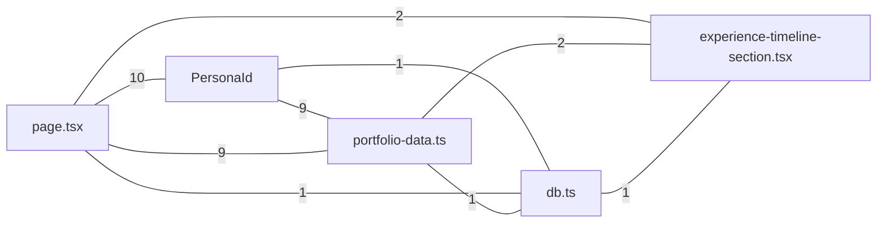

# Architecture

<!-- Generated by LIGA from the code graph. Do not edit — this file is overwritten whenever the code changes. -->

`28` files · `76` symbols · `129` references · `15` modules

Derived by parsing the source itself, not from any plan or description — so it reflects what the code *does*, including where that differs from what was intended.

## Module map

How the modules actually reference each other. Edge labels are reference counts.

## Most-connected symbols

Changing these has the widest blast radius.

| Symbol | Defined in | References |
|---|---|---|
| `PersonaId` | src/types/portfolio.ts:L1 | 10 |
| `PERSONAL_INFO` | src/data/portfolio-data.ts:L3 | 8 |
| `getAllContactMessages()` | src/lib/db.ts:L76 | 7 |
| `PERSONAS` | src/data/portfolio-data.ts:L27 | 6 |
| `insertContactMessage()` | src/lib/db.ts:L61 | 5 |
| `Navbar()` | src/components/navbar.tsx:L15 | 3 |
| `AboutPersonaSection()` | src/components/sections/about-persona-section.tsx:L13 | 3 |
| `EXPERIENCES` | src/data/portfolio-data.ts:L93 | 3 |
| `getDb()` | src/lib/db.ts:L7 | 3 |
| `CaseStudy` | src/types/portfolio.ts:L47 | 3 |
| `GET()` | src/app/api/contact/route.ts:L52 | 2 |
| `POST()` | src/app/api/contact/route.ts:L6 | 2 |

## Cross-module seams

The real contract surface between parts of the app.

| Module | Module | References |
|---|---|---|
| page.tsx | PersonaId | 10 |
| PersonaId | portfolio-data.ts | 9 |
| page.tsx | portfolio-data.ts | 9 |
| page.tsx | experience-timeline-section.tsx | 2 |
| portfolio-data.ts | experience-timeline-section.tsx | 2 |
| PersonaId | db.ts | 1 |
| db.ts | experience-timeline-section.tsx | 1 |
| page.tsx | db.ts | 1 |
| portfolio-data.ts | db.ts | 1 |
